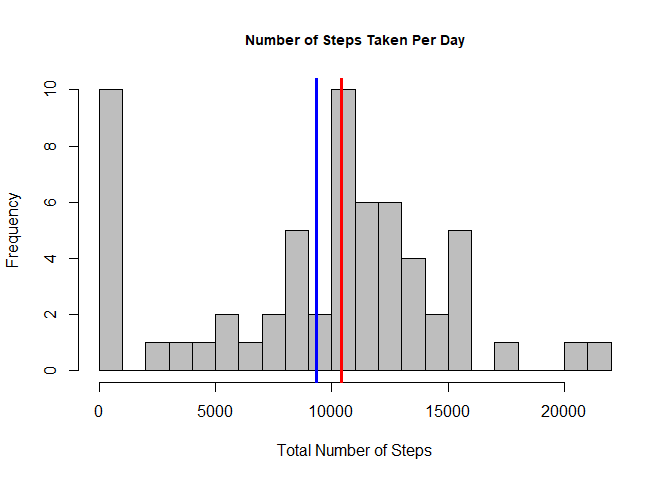
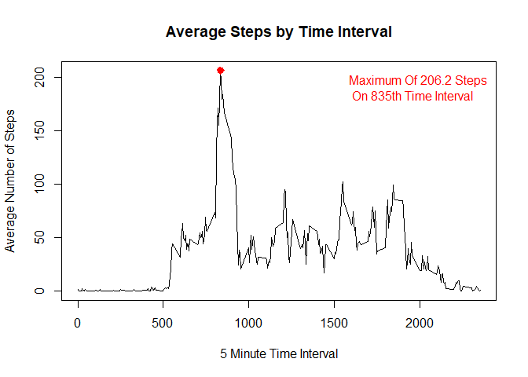
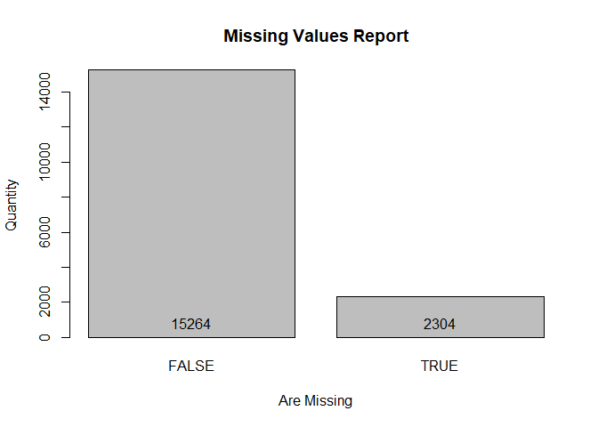
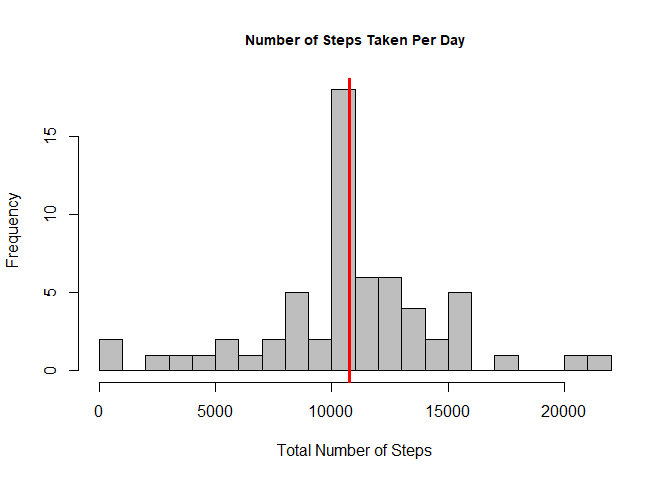
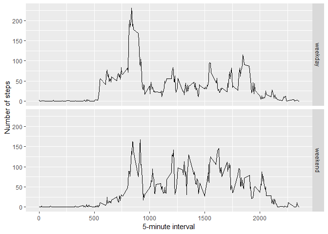

## Loading and preprocessing the data


```r
df_activity <- read.csv("activity.csv")
```


## What is mean total number of steps taken per day?
* summarize data per date

```r
aggActByDate <- aggregate(df_activity$steps, by=list(date=df_activity$date), FUN=sum, na.rm = TRUE)
```

* plot histogram with mean and median of the total number of steps taken per day

```r
hist(aggActByDate$x, breaks = 20, main = 'Number of Steps Taken Per Day',xlab = 'Total Number of Steps', col = 'grey',cex.main = .9)

abline(v=round(mean(aggActByDate$x),1), lwd = 3, col = 'blue')

abline(v=round(median(aggActByDate$x),1), lwd = 3, col = 'red')
```

<!-- -->

## What is the average daily activity pattern?
* Calculate the average daily activity (mean number of steps per interval)

```r
aggActByInterval <- aggregate(df_activity$steps, by=list(interval=df_activity$interval), FUN=mean, na.rm = TRUE)
```
* Plot the average daily activity per interval and the interval which contain maximum number of steps

```r
plot(aggActByInterval$interval, aggActByInterval$x, type = 'l', main = 'Average Steps by Time Interval', xlab = '5 Minute Time Interval', ylab = 'Average Number of Steps')

max_steps <- aggActByInterval[which.max(aggActByInterval$x),]

max_lbl = paste('Maximum Of ', round(max_steps$x, 1), ' Steps \n On ', max_steps$interval, 'th Time Interval', sep = '')

points(max_steps$interval,  max_steps$x, col = 'red', lwd = 3, pch = 10)
legend("topright",legend = max_lbl,text.col = 'red',bty = 'n')
```

<!-- -->

## Imputing missing values
* Calculate total number of missing values

```r
tb_missVal <- table(is.na(df_activity$steps))
bp <- barplot(tb_missVal, beside = TRUE, main = "Missing Values Report", xlab = "Are Missing", ylab = "Quantity")
text(bp, 0, tb_missVal, cex = 1, pos = 3)
```

<!-- -->


* Filling missing values with mean for that 5-minute interval

```r
df_fillVal <- aggregate(df_activity$steps, by=list(interval=df_activity$interval), FUN=mean, na.rm = TRUE)
df_completeVal <- df_activity
for (i in 1:nrow(df_completeVal)) 
{ 
    if ( is.na(df_completeVal[i,1])) 
        df_completeVal[i,1] <- df_fillVal[df_fillVal$interval == df_completeVal[i,3], 2]
    }

aggActByDate <- aggregate(df_completeVal$steps, by=list(date=df_completeVal$date), FUN=sum, na.rm = TRUE)

hist(aggActByDate$x, breaks = 20, main = 'Number of Steps Taken Per Day',xlab = 'Total Number of Steps', col = 'grey',cex.main = .9)

abline(v=round(mean(aggActByDate$x),1), lwd = 3, col = 'blue')

abline(v=round(median(aggActByDate$x),1), lwd = 3, col = 'red')
```

<!-- -->

## Are there differences in activity patterns between weekdays and weekends?


```r
library(dplyr)
library(ggplot2)

str_weekDay <- c("Monday", "Tuesday", "Wednesday", "Thursday", "Friday")
str_weekEnd <- c("Saturday", "Sunday")

df_completeVal$date <- as.Date(df_completeVal$date)

df_completeValWeek <- mutate(df_completeVal, week = factor(case_when(weekdays(date) %in% str_weekDay ~ "weekday", weekdays(date) %in% str_weekEnd ~ "weekend",TRUE ~ NA_character_)))

df_mean <- aggregate(steps ~ interval + week, data=df_completeValWeek, mean)

ggplot(df_mean, aes(interval, steps)) + geom_line() + facet_grid(week ~ .) + xlab("5-minute interval") + ylab("Number of steps")
```

<!-- -->
